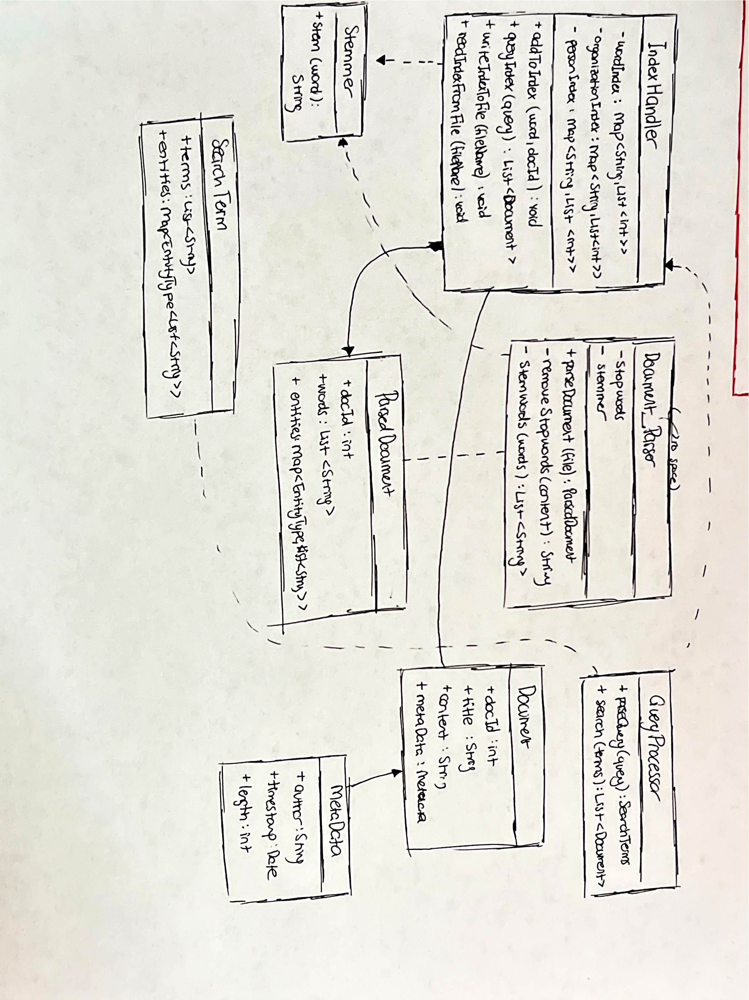

# Design (Search Engine):

* #### UML Diagram:

* #### Class Descriptions:

    1. **IndexHandler:** Manages the inverted index for quick searching of words, orgs, and person entites. Handles reading from and writing to the index. Performs search queries on the index based on user input. Stores the main index of words mapping to document IDs, the index of organization entities and person entites using 'maps'.
    2. **DocumentParser:** Processes each JSON news artticle, removes stopwords, stems words. Computes information necessary for relevancy. Contains a collection of stop words and creates an instace of stemmer for stemming.
    3. **QueryProcessor:** Parses the user queries into searchable terms and entitties; and uses the index to find relevant docs.
    4. **Document:** Represents a article, and holds the content and metadata of the document. Has attributes for document ID, title, content, and the metadata associated with each doc.
    5. **MetaData:** Contains the metadata of articles. These include, author, timestamp, and length information.
    6. **ParsedDocument:** Represents a processed doc with extracted words and entities. Has a list of words extracted and processed from the original document, and entites categorized by their type by the usage of 'lists' and 'maps'.
    7. **SearchTerms:** Holds the terms and entities extracted from a search query for processing. Contains the list from a user query and the 'map' of the entities identified in a query.
    8. **Stemmer:** Provides word stemming functionality. 

* #### Class Interactions:

    1. **Creating an Index:** 
    * The *DocumentParser* takes raw article (an instance of the *Document* class) as an input. It processes eacha aticle removing stopwords and stemming words as well as extracting entities from it. The processed data is then encapsulated into a *ParsedDocument* object.
    * The *IndexHandler* receives *ParsedDocument* objects from the *DocumentParser* and updates words,organizations, and people index.

    2. **Performing a Query:**
    * The *QueryProcessor* parses the input to identify terms and entities. The parsed query is converted into a *SearchTerm* object. 
    * The *SearchTerm* object is passed to the *IndexHandler* which looks up the relevant indices and retrieves a list of document IDs that match.
    *  The *IndexHandler* calculates the relevance scores for each document based on the frequency of terms. The results are then sorted and returned to the *QueryProcessor*.
    * The user is provided with a sorted list of document IDs and their corresponding *Document* objects retrieved and displayed. 

* #### Timeline:

| Week | Task | Due | Actual |
|---|---|---|---|
| **1** | Planning/ Design | 5/11 | 5/11 |
| **1** | AVL tree adaptation for the inverted file index | 9/11 |  |
| **1** | Test AVL-based map | 10/11 |  |
| **2** | Implement *DocumentParser* | 14/11 |  |
| **2** | Implement *IndexHandler* | 14/11 |  |
| **3** | Implement *QueryProcessor* | 20/11 |  |
| **3** | Create *User Interface* | 22/11 |  |
| **4** | Debugging and Testing | 29/11 |  |
| **4** | Cleaning and Finalizing | 2/12 |  |