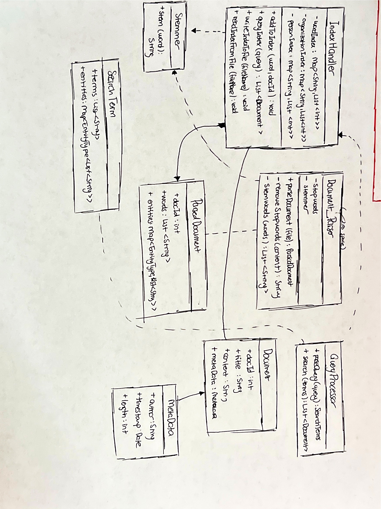

# 🧠 Search Engine for Business Articles  
*A high-performance C++ search engine that indexed 300,000+ business news articles using self-implemented data structures.*

---

## 📘 Overview  
This project is an individual C++ system I designed and implemented for my **Data Structures and Algorithms** course at **Southern Methodist University**.  
It simulates a miniature search engine capable of indexing and retrieving large text datasets efficiently using a **self-built AVL Tree**, **custom inverted index**, and **persistent data management system**.

The program parses thousands of business articles, constructs an inverted index mapping terms to documents, and enables querying via both command-line and interactive text-based interfaces.  
Performance and correctness were verified through unit testing, memory testing, and manual dataset validation.

---

## 🎯 Objectives  
- Develop a scalable **text search engine** from scratch in C++.  
- Implement a **custom AVL Tree–based Map** supporting O(log n) operations.  
- Build a **document parser** that tokenizes and filters stopwords.  
- Support **persistent indexing** to store and reload data efficiently.  
- Create a **user-friendly CLI** to perform queries, indexing, and analytics.  
- Apply **unit testing and memory profiling** to ensure robustness.

---

## ⚙️ Key Features  
- 🗂️ **Inverted Index Construction:** Maps keywords to document IDs for fast retrieval.  
- 🔍 **Query Processing Engine:** Supports Boolean-style keyword queries.  
- 💾 **Persistent Storage:** Saves indices to disk and reloads on demand.  
- 💬 **Interactive CLI UI:** Allows creating/loading indices and running queries.  
- 🧪 **Comprehensive Testing:** Catch2-based unit tests for AVL tree, parser, and index handler.  
- ⚡ **Performance Optimized:** Indexed 300K+ documents in under 2 minutes; query responses < 1 s.  

---

## 🧩 Project Architecture  

| Component | Description |
|------------|-------------|
| **`AVLTree.cpp` / `AVLTree.h`** | Self-balanced binary search tree serving as a key-value map. |
| **`DocumentParser.cpp` / `DocumentParser.h`** | Reads, tokenizes, and filters article text; removes stopwords. |
| **`IndexHandler.cpp` / `IndexHandler.h`** | Manages index creation, saving, and loading from disk. |
| **`QueryProcessor.cpp` / `QueryProcessor.h`** | Handles user queries and retrieves ranked document results. |
| **`UserInterface.cpp` / `UserInterface.h`** | Provides text-based UI with menus for indexing and querying. |
| **`stopwordRemover.cpp` / `stopwordRemover.h`** | Removes non-informative words from parsed text. |
| **`main.cpp`** | Entry point for the program, runs command-line options and UI. |

---

## 🧱 Technical Stack  

| Category | Details |
|-----------|----------|
| **Language** | C++17 |
| **Build System** | CMake |
| **Libraries** | RapidJSON, Catch2 |
| **Data Structures** | AVL Tree, Linked List, Hash Map (for optimization) |
| **Dataset** | [U.S. Financial News Articles – Kaggle](https://www.kaggle.com/jeet2016/us-financial-news-articles) |

---

## 🧠 System Design  

The following diagram illustrates the relationship between major components and data flow:  

  

- **Document Parser** reads raw text → cleans and tokenizes.  
- **Stopword Remover** filters non-essential words.  
- **Index Handler** builds the inverted index via the **AVL Tree Map**.  
- **Query Processor** retrieves relevant documents.  
- **User Interface** manages all interactions between the user and subsystems.  

---

## 💻 How to Build and Run  

```bash
# Clone repository
git clone https://github.com/fatihberkyozgatli/Search_Engine_Articles.git
cd Search_Engine_Articles

# Build the project
cmake . -B build -DCMAKE_BUILD_TYPE=Release
cd build
make supersearch

# Index all documents in a directory
./supersearch index <directory>

# Query the index
./supersearch query "social network PERSON:cramer"

# Launch the interactive text-based UI
./supersearch ui
```

## 🧪 Testing & Verification
|Test Type	| Purpose|
|-----------|----------|
|AVLTree Unit Tests|	Validate balancing, insertion, deletion, and traversal logic.|
|Persistence Tests|	Ensure saved indices reload identically.|
|System Tests|	Verify query correctness using known small datasets.|
|Memory Tests| (Valgrind)	Detect and resolve leaks and dangling pointers.|

## 📊 Performance Highlights

- Indexed 300,000+ articles from the Kaggle dataset.

- Achieved indexing speeds of > 2,000 documents per second.

- Query response time consistently under 1 second.

- Efficient disk persistence—load existing index in seconds.

## 📂 Documentation & Deliverables

|File |	Description|
|-----------|----------|
|DESIGN.md / DESIGN.pdf	|Detailed explanation of architectural choices and UML diagrams.|
|Answers.md	|Discussion of design, data structures, and testing methodology.|
|Project_Instructions.pdf	|Original assignment brief for academic context.|
|SearchEngineUML.jpg	|UML class diagram of the system.|

## 💬 Project Reflection

This project represents one of my first large-scale software engineering efforts, where I learned how to integrate algorithmic efficiency with system design principles.
Developing an end-to-end search engine taught me how indexing, persistence, and query processing come together in real-world information retrieval systems.
It also deepened my understanding of data structure trade-offs, memory management, and scalable design in C++.

## 👤 Author

Fatih Berk Yozgatli:  Computer Science & Data Science @ Southern Methodist University